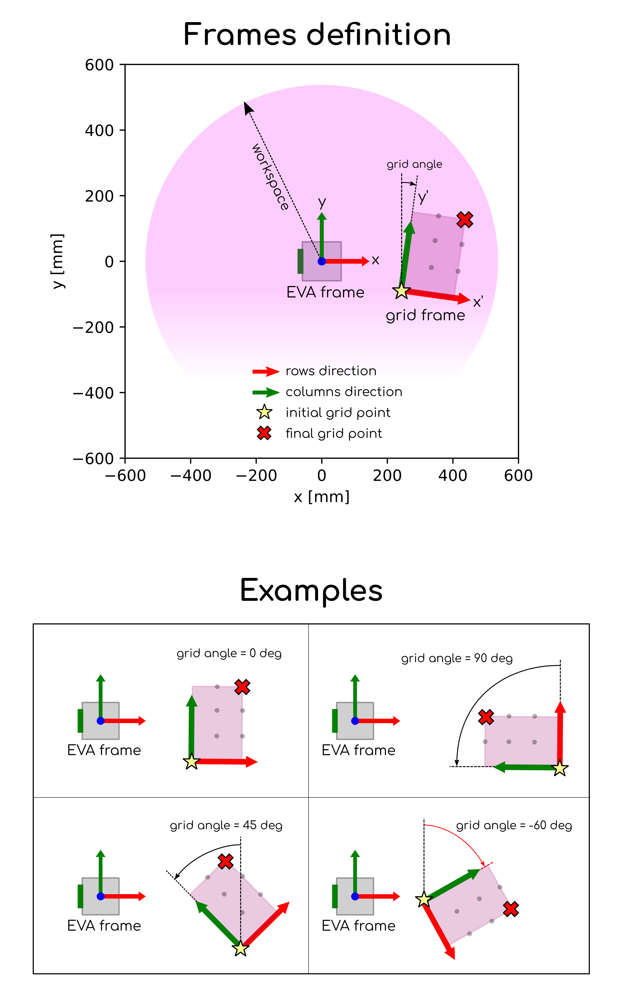

# Grid-to-grid pick and place application 
This example shows how to set-up a grid to grid toolpath for pick and place use-cases.

## Requirements

This example assumes you have two planar grids. The number of columns, rows, their respective pitch, 
the relative orientation, the objects' pickup angles and the grid's _z axis_ elevation are fully customizable.

In this version, we assumes that the grid planes are parallel to Eva's XY plane (that is, they are in an horizontal 
absolute plane). The rows and the columns, in addition, have to be perpendicular to each other. Finally, the number of 
points of the first grid (number of columns * number of rows) needs to be equal or smaller than the points 
of the second grid; if not, the first grid can not be correctly completed.

## Supported Version

Requirements to run this script as is:

- Eva software version: 3.x.x
- Eva Python SDK: 2.x.x

## Project description

__[main.py](grid2grid.py)__

This file is the main script and contains the logic behind the creation of the two grids. 
This file also creates the complete grid-to-grid tool-path, 
which can be run a fixed number of times or looped indefinitely.

You can use this file to modify the tool-path settings (speed, additional waypoints, IOs, etc). 
In particular, this file **must** be modified if additional operations have to be performed between 
the pickup and the drop-off points (i.e. inspection, measuring, filling, etc.).   

__[evaUtilities.py](evaUtilities.py)__

This file contains the auxiliary functions needed by the main **grid2grid.py** script 
(frame of reference handling, angle and quaternion conversion, forward and inverse kinematics, plotting). 
You **should not** changed this file.

__[config/config_manager.py](config/config_manager.py)__

This file loads the YAML parameter file. You **should not** changed this file.

__[config/use_case_config.yaml](config/use_case_config.yaml)__

This YAML file contains the parameters needed for the simulation, which are initialized to zero by default. 

In detailed, you will have to input:
- EVA setup (host, token, home position)
- grids characteristic (explained in detail in the next section)

**NOTE: without changing these parameters, EVA will automatically set its home position 
in the upright configuration, j = [0, 0, 0, 0, 0, 0].**

## Parameters description

The use-case is composed by 2 grids. The first one is referred in the YAML file as 'A', the second one as 'B'. 
The code solves the inverse kinematics of all the points of the grids, including the hover approach, which are
positioned on top of the grid points, with a selectable offset on the _z axis_.
This examples assumes you have familiarity with reference frames.

Eva's base reference frame is depicted in _Fig. 1_: all the definitions for the grids 
will be referred to Eva's base frame.

 
In order to illustrate how the grids are defined, we will use the nomenclature of the YAML file
dictionary (__[config/use_case_config.yaml](config/use_case_config.yaml)__) and the help of some illustrations. 
The YAML contains two entries for each tag, one for grid 'A', and one for grid 'B'.

In detail, going through the parameters of the **[grids]** tag:

- **names_verbose** [type: string]: this contains the verbose name of the grids, that can be 
chaged at the user's discretion.
- **row** [type: int, >0]: this is the number of rows of the grid
- **col** [type: int, >0]: this is the number of columns of the grid
- **row_pitch** [type: float, >0, unit: mm]: this is the distance (absolute value), measured in millimeters between two adjacent rows of the grid
- **col_pitch** [type: float, >0, unit: mm]: this is the distance (absolute value), measured in millimeters between two adjacent columns of the grid
- **x0** [type: float, unit: mm]: this is the _x-axis_ coordinate of the first corner point of the grid, 
measured with respect to the frame depicted in _Fig. 1_, expressed in millimeters. This will be the first object to be picked up.
- **y0** [type: float, unit: mm]: this is the _y-axis_ coordinate of the first corner point of the grid, 
measured with respect to the frame depicted in _Fig. 1_, expressed in millimeters. This will be the first object to be picked up.
- **angle** [type: float, unit: deg]: this is the rotation of the grid with respect to the frame depicted in _Fig. 1_, measured in degrees. 
_Fig. 2_ depicts the two frames of reference and the definition of this angle.
- **angle_pickup** [type: float, unit: deg]
- **surface** [type: float, unit: mm]
- **object** [type: float, >0, unit: mm]
- **guess** [type: list, unit: rad]

Plotting: 
After the definition of the grids, i